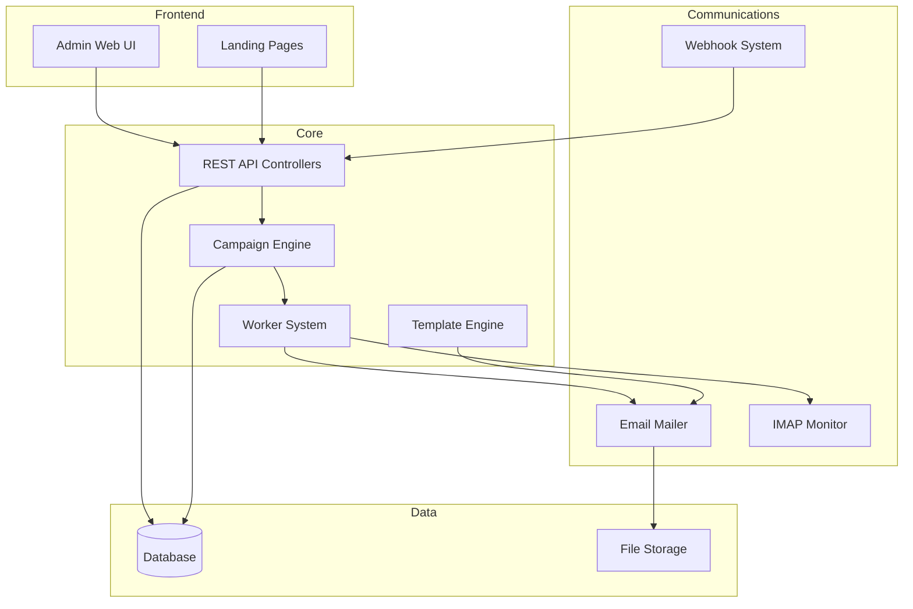
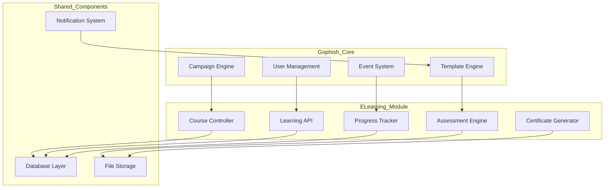
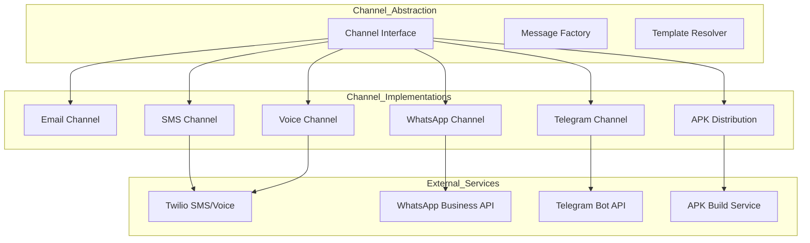
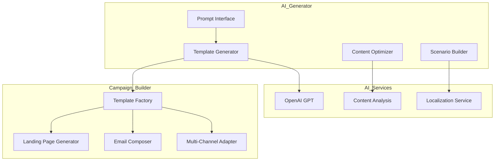
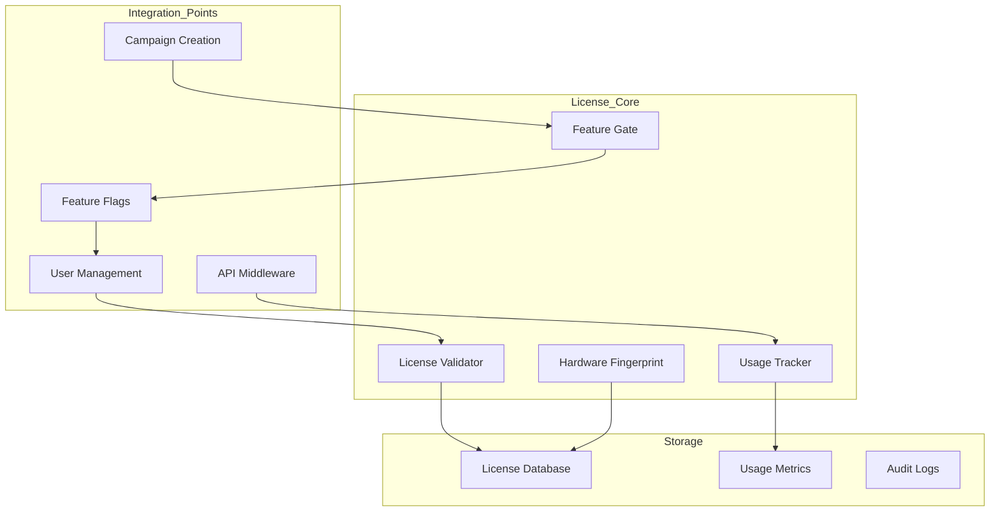

# Advanced Phishing Simulation Platform Architecture

## Executive Summary

This document outlines a comprehensive architectural plan to extend the existing Gophish platform with advanced features including:
- **Integrated e-learning platform** with auto-enrollment (embedded within Gophish codebase)
- **Multi-channel phishing capabilities** (SMS, voice calls, APK, messaging apps)
- **AI-powered campaign generator** for automated content creation
- **Enterprise licensing management** for commercial deployment

The design prioritizes **single codebase deployment** for simplified on-premise installations while providing enterprise-grade scalability and security.

## Current Architecture Analysis

### Core Components Overview

Gophish follows a modular architecture with clear separation of concerns:



### Extension Points Identified

1. **Worker System**: Modular design allows for new message types
2. **Template Engine**: Supports multiple content types
3. **Webhook System**: Enables external integrations
4. **Campaign Model**: Flexible structure for new campaign types
5. **Result Tracking**: Event-driven architecture for analytics

## Proposed Architecture Extensions

### 1. Integrated E-Learning Platform

#### Component Architecture (Within Gophish Codebase)



#### Implementation Strategy (Embedded in Gophish)

**New Models (models/course.go, models/learning.go):**
```go
// models/course.go
type Course struct {
    Id           int64     `json:"id" gorm:"column:id; primary_key:yes"`
    UserId       int64     `json:"-" gorm:"column:user_id"`
    Name         string    `json:"name" sql:"not null"`
    Description  string    `json:"description"`
    Content      string    `json:"content" gorm:"type:text"` // JSON content
    Duration     int       `json:"duration_minutes"`
    PassingScore int       `json:"passing_score"`
    IsActive     bool      `json:"is_active"`
    CreatedDate  time.Time `json:"created_date"`
    ModifiedDate time.Time `json:"modified_date"`
    Modules      []Module  `json:"modules" gorm:"foreignkey:CourseId"`
}

type Module struct {
    Id          int64     `json:"id" gorm:"column:id; primary_key:yes"`
    CourseId    int64     `json:"course_id"`
    Name        string    `json:"name"`
    ContentType string    `json:"content_type"` // video, text, quiz, interactive
    ContentData string    `json:"content_data" gorm:"type:text"`
    OrderIndex  int       `json:"order_index"`
    IsRequired  bool      `json:"is_required"`
}

type Enrollment struct {
    Id           int64      `json:"id" gorm:"column:id; primary_key:yes"`
    ResultId     string     `json:"result_id"`
    CourseId     int64      `json:"course_id"`
    Status       string     `json:"status"` // enrolled, in_progress, completed, failed
    EnrolledDate time.Time  `json:"enrolled_date"`
    DeadlineDate time.Time  `json:"deadline_date"`
    CompletedDate *time.Time `json:"completed_date,omitempty"`
    Progress     string     `json:"progress" gorm:"type:text"` // JSON progress data
    Score        int        `json:"score"`
}
```

**Integration Points (No External Services):**
- Extended event system in `models/campaign.go`
- New controllers in `controllers/api/learning.go`
- Enhanced templates for course notifications
- Direct database integration using existing GORM setup
- Built-in file storage for course content

### 2. Multi-Channel Communication System

#### Architecture Overview



#### Channel Implementation Strategy

**Base Channel Interface:**
```go
type Channel interface {
    Send(recipient Recipient, template Template, context TemplateContext) error
    Validate(config ChannelConfig) error
    GetCapabilities() ChannelCapabilities
}

type ChannelCapabilities struct {
    SupportsBinary     bool
    SupportsRichMedia  bool
    SupportsTracking   bool
    MaxMessageSize     int
}
```

**SMS Channel (Twilio Integration):**
```go
type SMSChannel struct {
    client *twilio.RestClient
    config SMSConfig
}

type SMSConfig struct {
    AccountSID  string `json:"account_sid"`
    AuthToken   string `json:"auth_token"`
    FromNumber  string `json:"from_number"`
}
```

**Voice Channel (Twilio Voice):**
```go
type VoiceChannel struct {
    client *twilio.RestClient
    config VoiceConfig
}

type VoiceConfig struct {
    AccountSID    string `json:"account_sid"`
    AuthToken     string `json:"auth_token"`
    FromNumber    string `json:"from_number"`
    VoiceURL      string `json:"voice_url"`     // TwiML endpoint
    RecordCalls   bool   `json:"record_calls"`
}
```

### 3. AI Campaign Generator

#### Architecture Design



#### Implementation Components

**AI Service Interface:**
```go
type AIGenerator interface {
    GenerateCampaign(prompt CampaignPrompt) (*GeneratedCampaign, error)
    OptimizeContent(content string, target Audience) (string, error)
    GenerateVariations(template Template, count int) ([]Template, error)
}

type CampaignPrompt struct {
    Industry        string   `json:"industry"`
    AttackVector    string   `json:"attack_vector"`
    TargetAudience  string   `json:"target_audience"`
    Complexity      string   `json:"complexity"`
    Channels        []string `json:"channels"`
    Language        string   `json:"language"`
    CustomContext   string   `json:"custom_context"`
}

type GeneratedCampaign struct {
    Name        string     `json:"name"`
    Description string     `json:"description"`
    Templates   []Template `json:"templates"`
    LandingPage Page       `json:"landing_page"`
    Scenarios   []Scenario `json:"scenarios"`
}
```

### 4. Licensing Management System

#### Architecture Overview (Embedded in Gophish)



#### Implementation Components

**License Models (models/license.go):**
```go
type License struct {
    Id                  int64     `json:"id" gorm:"column:id; primary_key:yes"`
    LicenseKey          string    `json:"license_key" gorm:"unique"`
    OrganizationName    string    `json:"organization_name"`
    ContactEmail        string    `json:"contact_email"`
    LicenseType         string    `json:"license_type"` // community, professional, enterprise
    MaxUsers            int       `json:"max_users"`
    MaxCampaignsPerMonth int      `json:"max_campaigns_per_month"`
    MaxTargetsPerCampaign int     `json:"max_targets_per_campaign"`
    Features            string    `json:"features" gorm:"type:text"` // JSON array
    IssuedDate          time.Time `json:"issued_date"`
    ExpiresDate         time.Time `json:"expires_date"`
    IsActive            bool      `json:"is_active"`
    HardwareFingerprint string    `json:"hardware_fingerprint"`
    LastValidated       time.Time `json:"last_validated"`
}

type LicenseUsage struct {
    Id              int64     `json:"id" gorm:"column:id; primary_key:yes"`
    LicenseId       int64     `json:"license_id"`
    PeriodStart     time.Time `json:"period_start"`
    PeriodEnd       time.Time `json:"period_end"`
    CampaignsCreated int      `json:"campaigns_created"`
    ActiveUsers     int       `json:"active_users"`
    FeaturesUsed    string    `json:"features_used" gorm:"type:text"` // JSON
    CreatedDate     time.Time `json:"created_date"`
}

type LicenseFeatures struct {
    MultiChannel      bool `json:"multi_channel"`
    ELearning         bool `json:"e_learning"`
    AIGenerator       bool `json:"ai_generator"`
    AdvancedAnalytics bool `json:"advanced_analytics"`
    WhiteLabeling     bool `json:"white_labeling"`
    SSO               bool `json:"sso"`
    API               bool `json:"api"`
    RBAC              bool `json:"rbac"`
}
```

**License Validation Service:**
```go
type LicenseManager interface {
    ValidateLicense(key string) (*License, error)
    CheckFeatureAccess(userID int64, feature string) bool
    TrackUsage(licenseID int64, action string) error
    GenerateHardwareFingerprint() string
    IsWithinLimits(licenseID int64, limitType string) bool
}

type DefaultLicenseManager struct {
    db *gorm.DB
}

func (lm *DefaultLicenseManager) CheckFeatureAccess(userID int64, feature string) bool {
    user, err := GetUser(userID)
    if err != nil {
        return false
    }
    
    if user.LicenseId == nil {
        // Community features only
        return isFeatureInCommunity(feature)
    }
    
    license, err := GetLicense(*user.LicenseId)
    if err != nil {
        return false
    }
    
    return license.HasFeature(feature) && license.IsValid()
}
```

## Database Schema Extensions

### New Tables

```sql
-- E-Learning Platform Tables (Integrated)
CREATE TABLE courses (
    id BIGINT AUTO_INCREMENT PRIMARY KEY,
    user_id BIGINT NOT NULL,
    name VARCHAR(255) NOT NULL,
    description TEXT,
    content TEXT, -- JSON content stored as text
    duration_minutes INT DEFAULT 0,
    passing_score INT DEFAULT 70,
    is_active BOOLEAN DEFAULT true,
    created_date DATETIME DEFAULT CURRENT_TIMESTAMP,
    modified_date DATETIME DEFAULT CURRENT_TIMESTAMP ON UPDATE CURRENT_TIMESTAMP,
    FOREIGN KEY (user_id) REFERENCES users(id) ON DELETE CASCADE
);

CREATE TABLE course_modules (
    id BIGINT AUTO_INCREMENT PRIMARY KEY,
    course_id BIGINT NOT NULL,
    name VARCHAR(255) NOT NULL,
    content_type ENUM('video', 'text', 'quiz', 'interactive') DEFAULT 'text',
    content_data TEXT, -- JSON data stored as text
    order_index INT DEFAULT 0,
    is_required BOOLEAN DEFAULT true,
    created_date DATETIME DEFAULT CURRENT_TIMESTAMP,
    FOREIGN KEY (course_id) REFERENCES courses(id) ON DELETE CASCADE
);

CREATE TABLE enrollments (
    id BIGINT AUTO_INCREMENT PRIMARY KEY,
    result_id VARCHAR(255) NOT NULL,
    course_id BIGINT NOT NULL,
    status ENUM('enrolled', 'in_progress', 'completed', 'failed', 'expired') DEFAULT 'enrolled',
    enrolled_date DATETIME DEFAULT CURRENT_TIMESTAMP,
    deadline_date DATETIME,
    completed_date DATETIME NULL,
    progress TEXT, -- JSON progress data
    score INT DEFAULT 0,
    FOREIGN KEY (course_id) REFERENCES courses(id) ON DELETE CASCADE
);

-- Licensing Management Tables
CREATE TABLE licenses (
    id BIGINT AUTO_INCREMENT PRIMARY KEY,
    license_key VARCHAR(255) UNIQUE NOT NULL,
    organization_name VARCHAR(255) NOT NULL,
    contact_email VARCHAR(255) NOT NULL,
    license_type ENUM('community', 'professional', 'enterprise') NOT NULL,
    max_users INT DEFAULT 1,
    max_campaigns_per_month INT DEFAULT 1,
    max_targets_per_campaign INT DEFAULT 10,
    features TEXT, -- JSON array of enabled features
    issued_date DATETIME DEFAULT CURRENT_TIMESTAMP,
    expires_date DATETIME,
    is_active BOOLEAN DEFAULT true,
    hardware_fingerprint VARCHAR(255),
    last_validated DATETIME
);

CREATE TABLE license_usage (
    id BIGINT AUTO_INCREMENT PRIMARY KEY,
    license_id BIGINT NOT NULL,
    period_start DATETIME NOT NULL,
    period_end DATETIME NOT NULL,
    campaigns_created INT DEFAULT 0,
    active_users INT DEFAULT 0,
    features_used TEXT, -- JSON data
    created_date DATETIME DEFAULT CURRENT_TIMESTAMP,
    FOREIGN KEY (license_id) REFERENCES licenses(id) ON DELETE CASCADE
);

-- Multi-Channel Tables
CREATE TABLE communication_channels (
    id BIGINT AUTO_INCREMENT PRIMARY KEY,
    user_id BIGINT NOT NULL,
    name VARCHAR(255) NOT NULL,
    channel_type ENUM('email', 'sms', 'voice', 'whatsapp', 'telegram', 'apk') NOT NULL,
    config JSON NOT NULL,
    is_active BOOLEAN DEFAULT true,
    created_date DATETIME DEFAULT CURRENT_TIMESTAMP,
    FOREIGN KEY (user_id) REFERENCES users(id) ON DELETE CASCADE
);

CREATE TABLE campaign_channels (
    id BIGINT AUTO_INCREMENT PRIMARY KEY,
    campaign_id BIGINT NOT NULL,
    channel_id BIGINT NOT NULL,
    channel_template JSON,
    send_order INT DEFAULT 1,
    delay_minutes INT DEFAULT 0,
    FOREIGN KEY (campaign_id) REFERENCES campaigns(id) ON DELETE CASCADE,
    FOREIGN KEY (channel_id) REFERENCES communication_channels(id) ON DELETE CASCADE
);

-- AI Generator Tables
CREATE TABLE ai_campaigns (
    id BIGINT AUTO_INCREMENT PRIMARY KEY,
    user_id BIGINT NOT NULL,
    prompt_data TEXT NOT NULL, -- JSON data stored as text
    generated_content TEXT, -- JSON data stored as text
    status ENUM('generating', 'completed', 'failed') DEFAULT 'generating',
    created_date DATETIME DEFAULT CURRENT_TIMESTAMP,
    FOREIGN KEY (user_id) REFERENCES users(id) ON DELETE CASCADE
);
```

### Extended Existing Tables

```sql
-- Add multi-channel support to campaigns
ALTER TABLE campaigns
ADD COLUMN channel_strategy ENUM('email_only', 'multi_channel', 'sequential', 'parallel') DEFAULT 'email_only',
ADD COLUMN auto_enrollment_course_id BIGINT NULL,
ADD FOREIGN KEY (auto_enrollment_course_id) REFERENCES courses(id) ON DELETE SET NULL;

-- Extend results for multi-channel tracking
ALTER TABLE results
ADD COLUMN channel_type VARCHAR(50) DEFAULT 'email',
ADD COLUMN channel_data TEXT; -- JSON data stored as text

-- Add AI generation tracking to templates
ALTER TABLE templates
ADD COLUMN generated_by_ai BOOLEAN DEFAULT false,
ADD COLUMN ai_prompt_data TEXT; -- JSON data stored as text

-- Add licensing constraints to users
ALTER TABLE users
ADD COLUMN license_id BIGINT NULL,
ADD FOREIGN KEY (license_id) REFERENCES licenses(id) ON DELETE SET NULL;
```

## API Extensions

### E-Learning Endpoints (controllers/api/learning.go)

```go
// Course Management (Integrated)
GET    /api/courses                    // List all courses for user
POST   /api/courses                    // Create new course
GET    /api/courses/{id}               // Get course details
PUT    /api/courses/{id}               // Update course
DELETE /api/courses/{id}               // Delete course
POST   /api/courses/{id}/test          // Test course completion flow

// Module Management
GET    /api/courses/{id}/modules       // List course modules
POST   /api/courses/{id}/modules       // Add module to course
PUT    /api/courses/{courseId}/modules/{moduleId}  // Update module
DELETE /api/courses/{courseId}/modules/{moduleId}  // Delete module

// Enrollment Management
GET    /api/enrollments                // List user's enrollments
POST   /api/enrollments                // Manual enrollment
GET    /api/enrollments/{id}           // Get enrollment details
PUT    /api/enrollments/{id}/progress  // Update progress
POST   /api/enrollments/{id}/complete  // Mark completion

// Progress Tracking & Analytics
GET    /api/campaigns/{id}/learning-progress  // Campaign learning analytics
GET    /api/learning/analytics         // Overall learning analytics
GET    /api/learning/certificates/{enrollmentId}  // Generate certificate
```

### Licensing Management Endpoints (controllers/api/license.go)

```go
// License Management
GET    /api/license                    // Get current license info
POST   /api/license/validate           // Validate license key
PUT    /api/license/activate           // Activate license
GET    /api/license/usage              // Get usage statistics
GET    /api/license/features           // Get enabled features

// Admin License Management (for license server)
GET    /admin/licenses                 // List all licenses
POST   /admin/licenses                 // Create new license
PUT    /admin/licenses/{id}            // Update license
DELETE /admin/licenses/{id}            // Revoke license
GET    /admin/licenses/{id}/usage      // Get license usage history
```

### Multi-Channel Endpoints

```go
// Channel Management
GET    /api/channels                   // List communication channels
POST   /api/channels                   // Create new channel
GET    /api/channels/{id}              // Get channel details
PUT    /api/channels/{id}              // Update channel
DELETE /api/channels/{id}              // Delete channel
POST   /api/channels/{id}/test         // Test channel configuration

// Multi-Channel Campaigns
POST   /api/campaigns/{id}/channels    // Add channel to campaign
DELETE /api/campaigns/{id}/channels/{channel_id}  // Remove channel
GET    /api/campaigns/{id}/channel-results        // Channel-specific results
```

### AI Generator Endpoints

```go
// AI Campaign Generation
POST   /api/ai/generate-campaign       // Generate campaign from prompt
GET    /api/ai/campaigns               // List AI generated campaigns
GET    /api/ai/campaigns/{id}          // Get AI campaign details
POST   /api/ai/campaigns/{id}/apply    // Apply AI campaign to actual campaign

// Content Optimization
POST   /api/ai/optimize-template       // Optimize template content
POST   /api/ai/generate-variations     // Generate template variations
POST   /api/ai/analyze-effectiveness   // Analyze campaign effectiveness
```

## Security & Compliance Considerations

### Data Protection

1. **Encryption at Rest**: All sensitive data encrypted using AES-256
2. **API Security**: OAuth 2.0 + JWT tokens with refresh rotation
3. **Channel Credentials**: Secure vault storage for third-party API keys
4. **Audit Logging**: Comprehensive activity logging for compliance

### Privacy Compliance

1. **GDPR Compliance**: 
   - Right to erasure for all personal data
   - Data portability for results and progress
   - Consent management for course enrollment

2. **Data Retention**: 
   - Configurable retention policies
   - Automatic purging of expired data
   - Legal hold capabilities

### Access Control

1. **Role-Based Access Control (RBAC)**:
   - Course Administrator
   - Channel Manager
   - Campaign Analyst
   - AI Content Manager

2. **Multi-Tenancy**: Isolated data per organization

## Implementation Roadmap

### Phase 1: Core Multi-Channel Foundation (8-10 weeks)

**Week 1-2: Architecture Setup**
- Database schema extensions
- Channel abstraction layer
- Base API framework

**Week 3-4: SMS Integration**
- Twilio SMS implementation
- SMS template system
- Testing framework

**Week 5-6: Voice Integration** 
- Twilio Voice implementation
- TwiML generator
- Call recording system

**Week 7-8: Messaging Apps**
- WhatsApp Business API integration
- Telegram Bot implementation
- Message template system

**Week 9-10: Testing & Documentation**
- End-to-end testing
- API documentation
- Security audit

### Phase 2: E-Learning Platform (6-8 weeks)

**Week 1-2: Core Learning Engine**
- Course management system
- Module delivery system
- Progress tracking

**Week 3-4: Auto-Enrollment System**
- Campaign integration
- Notification system
- Deadline management

**Week 5-6: Assessment & Certification**
- Quiz engine
- Certificate generation
- Compliance reporting

**Week 7-8: Analytics & Reporting**
- Learning analytics dashboard
- Progress visualization
- ROI calculation

### Phase 3: AI Campaign Generator (8-10 weeks)

**Week 1-2: AI Service Integration**
- OpenAI API integration
- Prompt engineering framework
- Content generation pipeline

**Week 3-4: Template Generation**
- Multi-channel template generation
- Content optimization
- A/B testing integration

**Week 5-6: Scenario Builder**
- Campaign flow generation
- Multi-step scenario creation
- Decision tree logic

**Week 7-8: Advanced Features**
- Content personalization
- Industry-specific templates
- Effectiveness prediction

**Week 9-10: Quality Assurance**
- AI output validation
- Human review workflow
- Performance optimization

### Phase 4: Advanced Features (4-6 weeks)

**Week 1-2: APK Distribution**
- Android APK generation
- Mobile device management
- Security scanning

**Week 3-4: Advanced Analytics**
- Cross-channel attribution
- Machine learning insights
- Predictive analytics

**Week 5-6: Enterprise Features**
- SSO integration
- Advanced reporting
- Compliance automation

## Technology Stack Requirements

### Additional Dependencies

**Go Packages:**
- `github.com/twilio/twilio-go` - SMS/Voice integration
- `go.mau.fi/whatsmeow` - WhatsApp integration  
- `github.com/go-telegram-bot-api/telegram-bot-api/v5` - Telegram
- `github.com/sashabaranov/go-openai` - OpenAI integration
- `github.com/golang-migrate/migrate/v4` - Database migrations

**External Services:**
- Twilio (SMS/Voice)
- WhatsApp Business API
- OpenAI GPT API
- Docker Registry (for APK builds)

### Infrastructure Requirements

**Minimum Additional Resources:**
- 2x CPU cores for AI processing
- 4GB additional RAM
- 100GB storage for course content
- Redis for caching AI responses
- Message queue (Redis/RabbitMQ) for channel processing

## Risk Assessment & Mitigation

### Technical Risks

1. **Third-party API Rate Limits**
   - Mitigation: Implement exponential backoff and queuing
   - Monitoring: Rate limit tracking and alerting

2. **AI Content Quality**
   - Mitigation: Human review workflow and quality scoring
   - Monitoring: Content effectiveness tracking

3. **Multi-channel Complexity**
   - Mitigation: Comprehensive testing and gradual rollout
   - Monitoring: Channel-specific error tracking

### Operational Risks

1. **Increased Support Complexity**
   - Mitigation: Enhanced documentation and training
   - Monitoring: Support ticket categorization

2. **Compliance Challenges**
   - Mitigation: Built-in compliance features and audit trails
   - Monitoring: Automated compliance checking

## Success Metrics

### Technical Metrics
- 99.9% uptime for multi-channel delivery
- <500ms API response time for AI generation
- 95% successful course completion tracking

### Business Metrics
- 60% improvement in training engagement
- 40% reduction in successful phishing attempts
- 25% increase in security awareness scores

### User Experience Metrics
- <5 minute campaign setup time
- 90% user satisfaction with AI-generated content
- 80% adoption rate of multi-channel campaigns

## Conclusion

This architectural plan provides a comprehensive roadmap for transforming Gophish into an advanced, multi-channel phishing simulation platform with integrated learning capabilities and AI-powered content generation. The phased implementation approach ensures minimal disruption to existing functionality while delivering significant value at each milestone.

The design maintains the core strengths of Gophish's modular architecture while extending it with enterprise-grade features that address modern security training requirements. The focus on security, compliance, and user experience ensures the platform can scale to meet the needs of large organizations while remaining accessible to smaller teams.